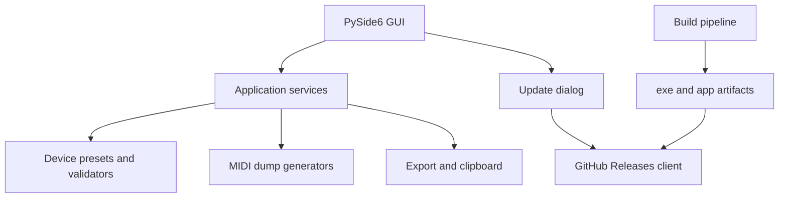

# План развития MIDI_hype

## Цель

Перевести проект из набора интерактивных консольных скриптов в поддерживаемое кроссплатформенное приложение с GUI на PySide6, сборкой под Windows `.exe` и macOS `.app`, а также автообновлением через GitHub Releases.

## Текущее состояние

- [`main.py`](../main.py) содержит консольный сценарий выбора синтезаторов, порядок вывода и запись дампа.
- [`JUNOg.py`](../JUNOg.py), [`xp60.py`](../xp60.py), [`TR.py`](../TR.py), [`X3.py`](../X3.py), [`VK7.py`](../VK7.py), [`boss_ve500.py`](../boss_ve500.py) смешивают MIDI-логику, ввод пользователя и форматирование вывода.
- Часть модулей использует изменяемое глобальное состояние, из-за чего повторные вызовы могут накапливать старые сообщения или изменять базовые шаблоны.
- [`README.md`](../README.md) не описывает запуск, зависимости, сборку и релизы.

## Целевая архитектура



## Предлагаемая структура проекта

```text
MIDI_hype/
  midi_hype/
    __init__.py
    app.py
    version.py
    core/
      models.py
      formatting.py
      validation.py
      dump_session.py
    devices/
      base.py
      juno_g.py
      xp60.py
      tr.py
      x3.py
      vk7.py
      boss_ve500.py
    gui/
      main_window.py
      device_forms.py
      dump_preview.py
      update_dialog.py
    updates/
      github_releases.py
      updater.py
  tests/
  packaging/
    pyinstaller_windows.spec
    pyinstaller_macos.spec
  plans/
    architecture_plan.md
  pyproject.toml
  README.md
```

## План реализации

1. Создать пакет [`midi_hype`](../midi_hype) и перенести туда основную логику приложения.
2. Ввести доменные модели: устройство, параметр устройства, MIDI-сообщение, сессия дампа, результат генерации.
3. Отделить генераторы MIDI от пользовательского ввода: функции должны принимать структурированные параметры и возвращать список байтов.
4. Исправить глобальное состояние в текущих генераторах: результаты и заголовки не должны мутировать между вызовами.
5. Добавить слой валидации параметров: MIDI-каналы, банки, номера патчей, октавы, режимы.
6. Добавить общий форматтер hex-дампа и общий экспорт в файл/буфер обмена.
7. Реализовать GUI на PySide6:
   - главное окно со списком выбранных устройств;
   - форма настройки выбранного устройства;
   - управление порядком вывода;
   - предпросмотр hex-дампа;
   - кнопки копирования, сохранения и генерации;
   - диалог проверки обновлений.
8. Сохранить консольный режим как совместимый fallback или отдельную команду, если это не усложнит архитектуру.
9. Добавить [`pyproject.toml`](../pyproject.toml) с зависимостями PySide6, pyperclip и инструментами сборки.
10. Настроить PyInstaller для Windows `.exe` и macOS `.app` через отдельные spec-файлы.
11. Добавить GitHub Actions workflow для сборки релизных артефактов на Windows и macOS.
12. Реализовать проверку GitHub Releases:
    - текущая версия хранится в [`midi_hype/version.py`](../midi_hype/version.py);
    - приложение запрашивает latest release;
    - сравнивает semver-версию;
    - показывает пользователю changelog и кнопку скачивания.
13. Для безопасного автообновления на первом этапе открывать страницу релиза или скачивать установочный архив без самоперезаписи исполняемого файла.
14. Для второго этапа предусмотреть платформенные сценарии замены приложения:
    - Windows: внешний updater-процесс заменяет `.exe` после закрытия приложения;
    - macOS: пользователь скачивает `.dmg` или `.zip` и заменяет `.app`, либо используется внешний updater-helper.
15. Добавить тесты для генераторов MIDI и checksum-функций, чтобы рефакторинг не ломал байтовые сообщения.
16. Обновить [`README.md`](../README.md): установка для разработки, запуск GUI, сборка, релизы, автообновление.

## Приоритеты реализации

1. Сначала стабилизировать MIDI-ядро и покрыть генераторы тестами.
2. Затем собрать минимальный GUI, который повторяет текущий консольный функционал.
3. После этого настроить packaging и проверить локальные сборки.
4. Затем подключить GitHub Releases и диалог проверки обновлений.
5. В конце расширить автообновление до платформенной замены приложения, если это потребуется.

## Основные технические решения

- GUI: PySide6.
- Packaging: PyInstaller.
- Релизы и автообновление: GitHub Releases.
- Версионирование: semver в отдельном модуле.
- Сетевой слой обновлений отделить от GUI, чтобы его можно было тестировать.
- Самообновление сделать поэтапно: сначала проверка и скачивание, затем автоматическая замена через helper.

## Риски и ограничения

- Полноценная самозамена приложения сложнее на macOS из-за прав, quarantine-атрибутов и подписи приложения.
- Для удобного распространения macOS `.app` может понадобиться подпись и notarization.
- Windows `.exe` без подписи может вызывать предупреждения SmartScreen.
- Текущие MIDI-генераторы нужно аккуратно рефакторить с тестами, потому что байтовые последовательности являются главным контрактом проекта.

## Критерии готовности

- Приложение запускается как GUI на Windows и macOS.
- Все поддерживаемые устройства доступны в интерфейсе.
- Пользователь может настроить устройства, поменять порядок, увидеть дамп, скопировать и сохранить его.
- Генераторы не используют пользовательский ввод напрямую и не зависят от глобального изменяемого состояния.
- Есть локальная команда сборки Windows `.exe` и macOS `.app`.
- GitHub Releases используются для публикации артефактов.
- В приложении есть проверка новой версии и понятный сценарий обновления.
